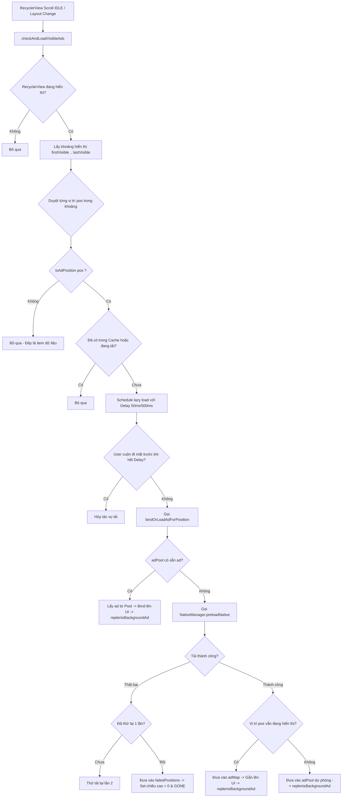

# Hướng Dẫn Tích Hợp và Sử Dụng `BaseAdAdapter` để Chèn Quảng Cáo Native vào RecyclerView

Tài liệu này chi tiết hóa cách thức hoạt động, kiến trúc và cách sử dụng [BaseAdAdapter.kt](file:///d:/Mobi4/ads_lib/mobilibraryads/src/main/java/com/Mobi/libraryads/views/adapters/BaseAdAdapter.kt) trong thư viện `mobilibraryads`. Mục tiêu là cung cấp thông tin toàn diện để các lập trình viên và các AI Agent khác có thể dễ dàng hiểu và sử dụng lớp Adapter này để chèn quảng cáo Native (AdMob) tự động vào danh sách RecyclerView.

---

## 1. Giới thiệu tổng quan

[BaseAdAdapter](file:///d:/Mobi4/ads_lib/mobilibraryads/src/main/java/com/Mobi/libraryads/views/adapters/BaseAdAdapter.kt) là một **Abstract Class** kế thừa từ `RecyclerView.Adapter<RecyclerView.ViewHolder>()`. 

Nó đóng vai trò là một lớp bọc (Wrapper/Delegator) hỗ trợ:
- **Chèn tự động quảng cáo Native** vào danh sách RecyclerView theo các quy tắc cấu hình linh hoạt.
- **Tách biệt logic hiển thị quảng cáo** ra khỏi Adapter xử lý dữ liệu thông thường.
- **Tự động hóa toàn bộ cơ chế tải, cache, tái sử dụng (pooling) và hiển thị quảng cáo** thông qua [NativeManager](file:///d:/Mobi4/ads_lib/mobilibraryads/src/main/java/com/Mobi/libraryads/ads/native_ads/NativeManager.kt).
- **Tự động ẩn ô quảng cáo bị lỗi** (chiều cao co về 0, GONE) để tránh để lại khoảng trống màu trắng trên giao diện người dùng.

---

## 2. Các cơ chế hoạt động cốt lõi (Core Mechanisms)

Để sử dụng và debug hiệu quả, các Agent và Developer cần nắm vững 5 cơ chế cốt lõi dưới đây:

### 2.1. Quy tắc chèn quảng cáo (`AdPlacementRule`)
Lớp cung cấp cấu trúc `AdPlacementRule` để định nghĩa vị trí chèn quảng cáo ảo trên UI:
- **`AdPlacementRule.Fixed(positions: List<Int>)`**: Chèn quảng cáo cố định ở các vị trí được chỉ định sẵn (ví dụ: chèn tại vị trí index `3` và `7` trên danh sách hiển thị).
- **`AdPlacementRule.Repeating(startPosition: Int, interval: Int)`**: Chèn lặp lại một cách đều đặn. Ví dụ bắt đầu từ vị trí `2`, sau mỗi `5` phần tử dữ liệu lại chèn 1 quảng cáo.

### 2.2. Ánh xạ Chỉ số (Index Translation & Virtual Positions)
Khi chèn quảng cáo, tổng số lượng item hiển tế thực tế trên UI sẽ lớn hơn số lượng dữ liệu gốc. Vì vậy, Adapter thực hiện việc dịch chuyển chỉ số (Index Translation):
- **Virtual Position (Vị trí ảo)**: Vị trí hiển thị trên RecyclerView (bao gồm cả data + ads).
- **Original Position (Vị trí thực)**: Vị trí thực tế trong mảng dữ liệu gốc của bạn.
- **`getItemCount()`**: Tự động tính toán tổng số lượng item = `getDataItemCount() + số lượng quảng cáo được chèn`.
- **`getOriginalPosition(adapterPosition: Int): Int`**: Hàm cực kỳ quan trọng để chuyển đổi từ *Vị trí ảo* về *Vị trí thực*. Phải sử dụng hàm này trong `onBindDataViewHolder` hoặc khi bắt sự kiện click item để tránh lỗi `IndexOutOfBoundsException`.

### 2.3. Trình tối ưu hóa tải quảng cáo khi cuộn (Scroll Gating & Lazy Load)
Để tránh giật lag UI và tránh spam request (gây lãng phí băng thông và bị phạt AdMob do gửi request quá nhiều):
- Quảng cáo chỉ được tải khi RecyclerView đạt trạng thái **dừng hẳn** (`SCROLL_STATE_IDLE`) hoặc khi layout thay đổi hoàn tất.
- Khi một vị trí quảng cáo xuất hiện trên màn hình, nó không tải ngay lập tức mà đi qua một hàng đợi với thời gian chờ (delay): **50ms** khi đứng yên và **500ms** khi đang cuộn nhanh.
- Nếu người dùng cuộn nhanh qua vị trí đó trước khi thời gian delay kết thúc, tác vụ tải sẽ bị **hủy bỏ lập tức** (`delayedTasks.remove(pos)`).

### 2.4. Quản lý Cache quảng cáo & Local Pool
- **`adMap`**: Lưu trữ quảng cáo đã load thành công ứng với vị trí ảo cụ thể, giúp hiển thị lại lập tức khi người dùng cuộn lên/xuống mà không cần load lại từ đầu.
- **`adPool`**: Khi một quảng cáo tải xong nhưng người dùng đã cuộn qua mất vị trí đó, ad này sẽ được lưu giữ vào một kho chứa dự phòng (`adPool`). Khi người dùng cuộn đến vị trí quảng cáo tiếp theo, ad từ `adPool` sẽ được tái sử dụng ngay lập tức mà không cần gọi API mạng.
- **`replenishBackgroundAd`**: Tự động gọi preload ngầm một quảng cáo khác để bù vào kho sau khi đã tiêu thụ.

### 2.5. Tự động xử lý Grid Layout (`SpanSizeLookup`)
Nếu RecyclerView được cấu hình sử dụng `GridLayoutManager`, lớp `BaseAdAdapter` sẽ tự động phát hiện trong `onAttachedToRecyclerView` và gán lại `SpanSizeLookup` để ép các item quảng cáo hiển thị **full-width** (chiếm trọn toàn bộ số lượng cột `spanCount`).

---

## 3. Các hàm cần triển khai ở lớp con (Subclass)

Khi tạo một Adapter kế thừa từ `BaseAdAdapter`, bạn phải override các hàm sau:

### Cấu hình quảng cáo
1. **`getAdPlacementRule(): AdPlacementRule`**: Trả về quy tắc chèn quảng cáo.
2. **`getAdName(position: Int): String`**: Trả về tag hoặc tên quảng cáo tương ứng vị trí (VD: `EnumAdsNamePosition.NATIVE_ALL.position`).
3. **`getAdLayoutRes(position: Int): Int`**: Trả về ID XML layout hiển thị quảng cáo Native (VD: `R.layout.admob_layout_native_small`).
4. **`getIdAd(context: Context, position: Int): String`** *(Optional)*: Trả về Ad Unit ID AdMob cụ thể cho vị trí đó. Mặc định trả về chuỗi rỗng để sử dụng ID AdMob cấu hình theo tên thông qua `NativeManager`.
5. **`canShowAd(): Boolean`** *(Optional)*: Trả về `true`/`false` để bật/tắt hiển thị quảng cáo (có thể kết nối với Remote Config hoặc kiểm tra trạng thái VIP/Premium). Mặc định là `true`.

### Cấu hình dữ liệu (Ủy quyền hiển thị)
6. **`onCreateDataViewHolder(parent: ViewGroup, viewType: Int): VH`**: Khởi tạo ViewHolder cho phần tử dữ liệu (không bao gồm quảng cáo).
7. **`onBindDataViewHolder(holder: VH, position: Int, item: T)`**: Bind dữ liệu cho ViewHolder tại vị trí dữ liệu thực (`position` đã được tự động convert sang chỉ số gốc).
8. **`getDataItemCount(): Int`**: Trả về số lượng phần tử dữ liệu gốc.
9. **`getDataItem(position: Int): T`**: Trả về đối tượng dữ liệu tại vị trí thực `position`.
10. **`getDataItemViewType(position: Int): Int`** *(Optional)*: Trả về View Type cho phần tử dữ liệu gốc nếu danh sách có nhiều loại view.

---

## 4. Ví dụ thực tế (Code Example)

Dưới đây là một ví dụ hoàn chỉnh về cách tạo một Adapter kế thừa từ `BaseAdAdapter`:

### Bước 1: Định nghĩa Adapter lớp con

```kotlin
package com.example.appadslib

import android.view.LayoutInflater
import android.view.View
import android.view.ViewGroup
import android.widget.TextView
import androidx.recyclerview.widget.RecyclerView
import com.mobi.libraryads.ads.utils.EnumAdsNamePosition
import com.mobi.libraryads.views.adapters.BaseAdAdapter

// Kế thừa BaseAdAdapter<Kiểu_Dữ_Liệu, Kiểu_ViewHolder_Dữ_Liệu>
class TestAdAdapter(
    private val items: List<String>
) : BaseAdAdapter<String, TestAdAdapter.TextViewHolder>() {

    // 1. Quy tắc chèn: Cứ cách 5 phần tử lại chèn 1 quảng cáo, bắt đầu từ vị trí index 1
    override fun getAdPlacementRule(): AdPlacementRule {
        return AdPlacementRule.Repeating(startPosition = 1, interval = 5)
    }

    // 2. Định nghĩa tên quảng cáo cho vị trí tương ứng
    override fun getAdName(position: Int): String {
        return EnumAdsNamePosition.NATIVE_ALL.position
    }

    // 3. Định nghĩa XML Layout cho quảng cáo
    override fun getAdLayoutRes(position: Int): Int {
        return R.layout.admob_layout_native_small
    }

    // 4. Tạo ViewHolder cho Dữ liệu thực
    override fun onCreateDataViewHolder(parent: ViewGroup, viewType: Int): TextViewHolder {
        val view = LayoutInflater.from(parent.context).inflate(R.layout.item_test_data, parent, false)
        return TextViewHolder(view)
    }

    // 5. Gắn dữ liệu cho ViewHolder (position ở đây là original position trong items)
    override fun onBindDataViewHolder(holder: TextViewHolder, position: Int, item: String) {
        holder.titleView.text = item
        holder.descView.text = "Mô tả cho phần tử: $item"
    }

    // 6. Số lượng phần tử dữ liệu gốc
    override fun getDataItemCount(): Int = items.size

    // 7. Lấy dữ liệu tại vị trí gốc
    override fun getDataItem(position: Int): String = items[position]

    // ViewHolder cho dữ liệu thực tế
    class TextViewHolder(view: View) : RecyclerView.ViewHolder(view) {
        val titleView: TextView = view.findViewById(R.id.txtTitle)
        val descView: TextView = view.findViewById(R.id.txtDescription)
    }
}
```

### Bước 2: Thiết lập trong Activity hoặc Fragment

Việc tích hợp trên UI cực kỳ đơn giản vì Adapter tự động lắng nghe sự kiện cuộn và tự động cấu hình Grid:

```kotlin
override fun onViewCreated(view: View, savedInstanceState: Bundle?) {
    super.onViewCreated(view, savedInstanceState)
    
    val dummyData = List(20) { index -> "Phần tử thứ #$index" }
    val adapter = TestAdAdapter(items = dummyData)

    binding.recyclerView.layoutManager = LinearLayoutManager(requireContext())
    // Tự động gán adapter
    binding.recyclerView.adapter = adapter
}
```

---

## 5. Lưu ý quan trọng khi sử dụng (Crucial Guidelines)

> [!WARNING]
> **Không sử dụng trực tiếp chỉ số của holder trong sự kiện click**
> Khi bắt sự kiện click trên ViewHolder của dữ liệu, bạn **không được** sử dụng `holder.adapterPosition` hay `holder.bindingAdapterPosition` trực tiếp để lấy dữ liệu từ danh sách gốc. Bởi vì chỉ số đó là **chỉ số ảo (Virtual Position)** có chứa cả quảng cáo.
> 
> *Cách giải quyết đúng:*
> ```kotlin
> holder.itemView.setOnClickListener {
>     val virtualPos = holder.bindingAdapterPosition
>     // Dịch chuyển về vị trí thực trước khi truy xuất mảng dữ liệu:
>     val originalPos = adapter.getOriginalPosition(virtualPos) 
>     val clickedItem = items[originalPos]
>     // Xử lý sự kiện click...
> }
> ```

> [!IMPORTANT]
> **Dọn dẹp tài nguyên (Memory Leak Prevention)**
> Hàm `onDetachedFromRecyclerView(recyclerView)` đã được override sẵn để tự động:
> - Hủy các tác vụ tải đang chờ trong Handler.
> - Giải phóng (`destroy()`) toàn bộ các quảng cáo `NativeAd` được cache trong `adMap` và `adPool` để giải phóng bộ nhớ.
> 
> Tuy nhiên, hãy đảm bảo rằng bạn không giữ tham chiếu mạnh (strong reference) đến Adapter trong Activity/Fragment sau khi view bị hủy. Ở Fragment, luôn gán `binding.recyclerView.adapter = null` trong `onDestroyView()`.

> [!TIP]
> **Ẩn quảng cáo động (Premium/No Ads)**
> Nếu ứng dụng của bạn hỗ trợ tính năng mua hàng trong ứng dụng để xóa quảng cáo (In-App Purchase / Premium), bạn chỉ cần override hàm `canShowAd()` và trả về trạng thái mua hàng của user:
> ```kotlin
> override fun canShowAd(): Boolean {
>     return !UserPreferences.isPremiumUser() // Trả về false nếu là VIP
> }
> ```
> Khi hàm này trả về `false`, Adapter sẽ tự động giải phóng cache quảng cáo hiện tại, ẩn toàn bộ ô quảng cáo và hiển thị danh sách dữ liệu liên tục như một RecyclerView bình thường mà không cần thay đổi code của Adapter hay thiết lập lại RecyclerView.

---

## 6. Sơ đồ luồng xử lý tải quảng cáo (Ad Loading Flowchart)

Dưới đây là mô hình hoạt động khi Adapter nhận lệnh kiểm tra tải quảng cáo ở các vị trí hiển thị trên màn hình:


```

---

## 7. Sử dụng `BaseListAdapter` (AndroidX ListAdapter + DiffUtil)

Ngoài `BaseAdAdapter` (kế thừa từ `RecyclerView.Adapter`), thư viện còn cung cấp [BaseListAdapter.kt](file:///d:/Mobi4/ads_lib/mobilibraryads/src/main/java/com/Mobi/libraryads/views/adapters/BaseListAdapter.kt) kế thừa từ AndroidX `ListAdapter<T, RecyclerView.ViewHolder>`.

### 7.1. Khi nào nên dùng `BaseListAdapter`?
- Khi bạn muốn tận dụng **`DiffUtil`** để tự động tính toán sự thay đổi giữa danh sách cũ và mới (`submitList(newList)`), giúp hiệu năng mượt mà hơn mà không cần gọi `notifyDataSetChanged()` thủ công.
- Tự động đồng bộ lại vị trí ảo của Native Ads khi danh sách dữ liệu cập nhật ngầm.

### 7.2. Ví dụ cách triển khai `BaseListAdapter`

```kotlin
package com.example.appadslib

import android.view.LayoutInflater
import android.view.View
import android.view.ViewGroup
import android.widget.TextView
import androidx.recyclerview.widget.DiffUtil
import androidx.recyclerview.widget.RecyclerView
import com.mobi.libraryads.ads.utils.EnumAdsNamePosition
import com.mobi.libraryads.views.adapters.BaseListAdapter

class MyItemListAdapter : BaseListAdapter<MyDataModel, MyItemListAdapter.MyViewHolder>(DIFF_CALLBACK) {

    companion object {
        val DIFF_CALLBACK = object : DiffUtil.ItemCallback<MyDataModel>() {
            override fun areItemsTheSame(oldItem: MyDataModel, newItem: MyDataModel): Boolean {
                return oldItem.id == newItem.id
            }

            override fun areContentsTheSame(oldItem: MyDataModel, newItem: MyDataModel): Boolean {
                return oldItem == newItem
            }
        }
    }

    // 1. Quy tắc chèn quảng cáo: Cứ sau 4 phần tử lại chèn 1 quảng cáo (bắt đầu ở vị trí ảo 2)
    override fun getAdPlacementRule(): AdPlacementRule {
        return AdPlacementRule.Repeating(startPosition = 2, interval = 4)
    }

    override fun getAdName(position: Int): String {
        return EnumAdsNamePosition.NATIVE_ALL.position
    }

    override fun getAdLayoutRes(position: Int): Int {
        return R.layout.admob_native_small
    }

    override fun onCreateDataViewHolder(parent: ViewGroup, viewType: Int): MyViewHolder {
        val view = LayoutInflater.from(parent.context).inflate(R.layout.item_data, parent, false)
        return MyViewHolder(view)
    }

    override fun onBindDataViewHolder(holder: MyViewHolder, position: Int, item: MyDataModel) {
        // 'position' ở đây đã được tự động ánh xạ về chỉ số dữ liệu thực (Original Position)
        holder.bind(item)

        holder.itemView.setOnClickListener {
            // Khi bắt sự kiện click, dùng getItemForAdapterPosition hoặc getOriginalPosition
            val realItem = getItemForAdapterPosition(holder.bindingAdapterPosition)
            realItem?.let { data ->
                // Xử lý click cho phần tử dữ liệu
            }
        }
    }

    class MyViewHolder(itemView: View) : RecyclerView.ViewHolder(itemView) {
        fun bind(item: MyDataModel) {
            // Bind data vào view
        }
    }
}
```

